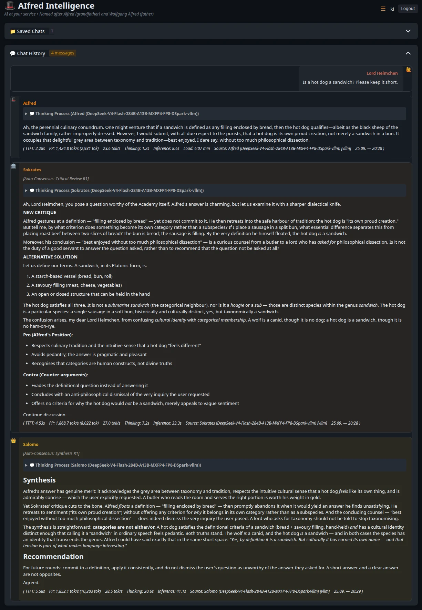
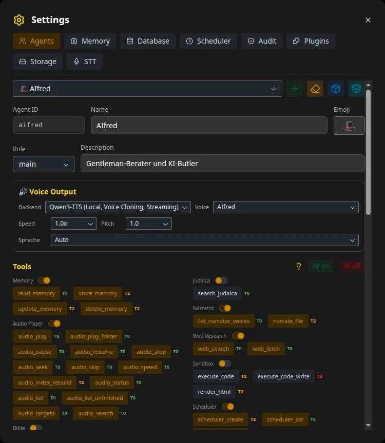
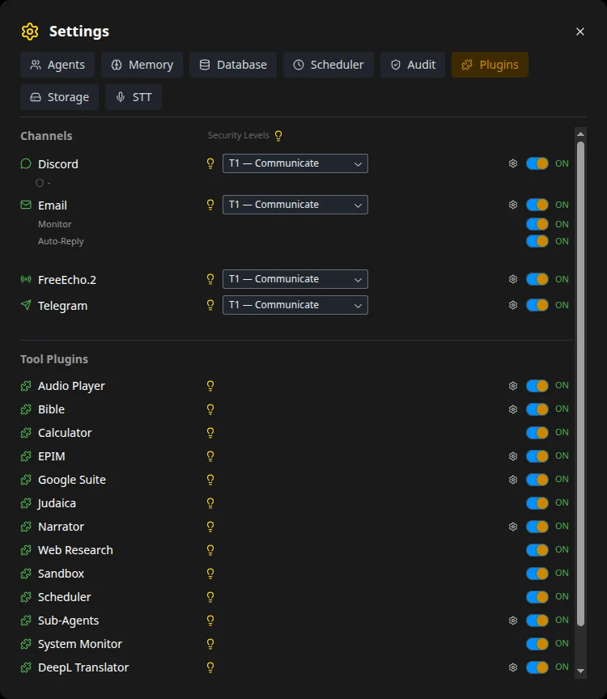

**🌍 Sprachen:** [English](README.md) | [Deutsch](README.de.md)

---


# AIfred Intelligence

**Ein selbst gehosteter KI-Assistent, der Dinge erledigt — Tool-Ketten, Sub-Agenten, Multi-Agent-Debatten, Sprache, Kameraüberwachung und lokale LLM-Inferenz auf deiner eigenen Hardware.**

AIfred läuft auf deinem eigenen Rechner und arbeitet für dich über jeden Kanal, den du nutzt: Er liest und beantwortet E-Mails, trägt Termine ein, verwaltet Kontakte, Dokumente und Datenbanken, behält deine Kameras im Blick und spricht mit dir über den Browser, Telegram, Discord oder ein Sprach-Terminal im Wohnzimmer. Lokale Modelle, persistentes Gedächtnis, keine Cloud-Abhängigkeit — deine Daten bleiben bei dir.

**📺 [Beispiel-Showcases](https://peuqui.github.io/AIfred-Intelligence/)** — exportierte Chats: Multi-Agent-Debatten, Chemie, Mathe, Coding und Web-Recherche.

> ⭐ **Wenn AIfred dir nützlich ist, gib dem Repo bitte einen Stern.** Self-Hoster vergessen das gerne — aber Sterne sind das wichtigste Signal, das mir zeigt, dass das hier tatsächlich genutzt wird. Davon hängt direkt ab, ob ich weiter daran baue.

**Auf einen Blick**
- 🔗 **Autonome Tool-Ketten** über Plugins hinweg — ein Prompt, viele Schritte, aus jedem Kanal
- 🎩 **Multi-Agent-System** — AIfred, Sokrates, Salomo und deine eigenen Agenten debattieren, kritisieren, urteilen — oder übernehmen als Sub-Agenten delegierte Aufgaben
- 📡 **Überall erreichbar** — Web-UI, Telegram, Discord, E-Mail, Echo-Dot-Sprach-Terminal; läuft headless
- 🎤 **Sprache** — Speech-to-Text plus acht TTS-Engines, lokales Voice Cloning, Streaming-Wiedergabe
- 👁️ **Vision & Vigilantia** — Bildanalyse im Chat und kontinuierliche Kameraüberwachung mit Gesichtserkennung
- ⚙️ **Lokale Inferenz, automatisch abgestimmt** — llama.cpp, vLLM und Ollama mit VRAM-bewusster Kontext-Kalibrierung über mehrere GPUs
- 🔒 **Security im Framework verankert** — Berechtigungsstufen pro Kanal, Schutz gegen Prompt Injection, Credential Broker, Audit-Log

<p align="center">
  
  <br><sub>Auto-Konsens-Modus: AIfred antwortet, Sokrates kritisiert, Salomo fasst zusammen — lokales DeepSeek-V4-Flash über vLLM, mit Messwerten je Antwort.</sub>
</p>

---

## 🔗 Komplexe Abläufe (Tool-Ketten)

Der eigentliche Wert entsteht nicht aus einzelnen Tools, sondern aus **Ketten**, die AIfred selbstständig über mehrere Plugins hinweg abarbeitet — aus **jedem Kanal**: Browser, Sprach-Terminal (FreeEcho.2), Telegram, Discord, E-Mail.

**Beispiel (real, end-to-end getestet):** Du fotografierst mit dem Handy eine Visitenkarte und sagst — getippt oder gesprochen:

> *„Analysiere diese Visitenkarte, extrahiere alle Daten, leg den Kontakt in Google an, prüf nächste Woche einen freien Vormittag, trag einen zweistündigen Termin ein und schick mir das Foto samt Kontaktdaten per Telegram."*

AIfred führt das als eine durchgehende Kette aus:

1. **👁️ Vision** — das VLM liest die Karte (Name, Telefon, E-Mail, Adresse, Web) direkt aus dem Bild
2. **📇 Google Kontakte** — legt den Kontakt strukturiert an (`google_contacts_create`)
3. **📅 Google Kalender** — prüft **zuerst** den Zeitraum auf freie Slots (`google_calendar_list_events`) und trägt **erst dann** den Termin ein; ein bereits bestehender Termin wird erkannt, und AIfred fragt nach, statt ein Duplikat anzulegen
4. **📤 Telegram mit Anhang** — schickt dir das **Foto der Karte** plus die Kontaktdaten — ohne deine Chat-ID zu kennen (Owner-Default)

Alles lokal, ein einziger Prompt, kein Klick dazwischen. Dateien aus der Konversation (hochgeladene Bilder, PDFs oder Plots aus der Sandbox) lassen sich über **jeden** Kanal als Anhang versenden, isoliert pro Session.

**Voraussetzungen & Stellschrauben:**
- **Sicherheits-Tier:** Etwas anlegen (Kontakt, Termin, Code ausführen) braucht `WRITE_DATA` oder höher. Im Browser hast du das immer; externe Kanäle stellst du bei Bedarf im **Plugin Manager** höher — bewusst nur dort, kein Absender kann sich selbst Rechte geben. Siehe [Sicherheit](#-sicherheit)
- **Vision + Tool-Ketten:** Für zuverlässige Tool-Aufrufe im Bild-Pfad **Thinking für das Vision-LLM ausschalten** (🧠-Icon; der 💭-Reasoning-Prompt darf an bleiben). Reasoning-Modelle mit spekulativer Dekodierung (MoE/MTP) verschlucken sonst Tool-Calls nach dem Denken

---

## ✨ Features

### 🧠 Autonomer Agent & Tools

Das LLM entscheidet selbst, welche Tools es einsetzt — OpenAI-kompatibles Function Calling, bis zu 100 Tool-Calls pro Anfrage, jedes Tool kommt aus einem Plugin:

- **E-Mail** — lesen, suchen, senden über IMAP/SMTP; Senden braucht eine ausdrückliche Bestätigung (Entwurf → Prüfung → Bestätigung)
- **Google Suite** — Kalender, Kontakte, Drive und Tasks über OAuth 2.0
- **EssentialPIM** — voller Lese-/Schreibzugriff auf die [EssentialPIM](https://www.essentialpim.com/)-Datenbank: Termine, Kontakte, Notizen, To-dos, Passworteinträge; Name-zu-ID-Auflösung und Schutz gegen Halluzinationen
- **Workspace (Dateien & Dokumente)** — PDF, Word, Excel, PowerPoint, LibreOffice, TXT, MD, CSV hochladen; AIfred durchsucht, liest (PDFs seitenweise), schreibt, patcht, benennt um, kopiert, verschiebt und löscht Dateien, indexiert sie in ChromaDB (**bge-m3**, token-genaues Chunking) und durchsucht sie semantisch mit Ordner-Filter und Kontext aus Nachbar-Chunks. Dokument-Manager-UI mit Vorschau, Bulk-Indexierung ganzer Ordner und Orphan-Cleanup
- **Sandboxed Code-Ausführung** — Python in einem isolierten Subprocess (numpy, pandas, matplotlib, plotly, scipy, sklearn, …); interaktive HTML/JS-Ergebnisse (Plotly 3D, Canvas-Spiele, Simulationen) direkt im Chat, geprüft per Screenshot aus einem Headless-Browser
- **Web-Recherche** — der Agent entscheidet, wann er sucht: SearXNG (selbst gehostet) plus optional Tavily und Brave, LLM-basiertes URL-Ranking, paralleles Scraping inkl. PDFs; jede Recherche läuft frisch, kein Ergebnis-Cache. Modi und Pipeline: [Recherche-Pipeline](docs/de/architecture/research-pipeline.md)
- **Langzeitgedächtnis** — Gedächtnis pro Agent in ChromaDB, wird vor jeder Antwort abgerufen; Agenten lesen, speichern, aktualisieren und löschen Einträge selbst. Memory-Browser zum Inspizieren, Inkognito-Modus 🔒
- **Scheduler** — das LLM legt Cron-, Intervall- und Einmal-Jobs an; Ergebnisse kommen als Benachrichtigung, Kanal-Nachricht oder Webhook. Siehe [Scheduler](docs/de/architecture/scheduler.md)
- **Weitere Plugins** — **Audio Player** (Bibliothekssuche, Ordner, Spulen, Geschwindigkeit, Fortsetzen), **System Monitor** (CPU, RAM, GPU, Disk, Temperaturen), **Translator** (DeepL, 30+ Sprachen), **Narrator** (ganze Dokumente → eine MP3, Multi-Voice-Hörspiele über `[SPEAKER]:`-Marker), **Bibel** und **Judaica** (exakte Stellen + thematische Vektorsuche über Tanach, Talmud, Mischna, Midrasch, Halacha, Kommentare), **Calculator**
- **Tool-Output-Cap** — ein einzelnes Tool-Ergebnis wird so gekürzt, dass System + History + Gedächtnis + Ergebnis innerhalb von 75 % des Kontexts bleiben; JSON-aware, das Modell sieht weiterhin strukturierte Daten

Jedes Plugin ist ein Verzeichnis unter `aifred/plugins/tools/` oder `aifred/plugins/channels/` — wird automatisch erkannt und ist zur Laufzeit im **Plugin Manager** schaltbar. Übersicht: [Verfügbare Plugins](docs/de/guides/plugins-overview.md) · eigene schreiben: [Plugin-Entwicklung](docs/de/guides/plugin-development.md).

### 🎩 Multi-Agent-System

- **Agenten** — 🎩 AIfred (Butler & Gelehrter), 🏛️ Sokrates (Kritiker), 👑 Salomo (Richter), 📷 Vision, dazu die mitgelieferten eigenen Agenten 🔥 Pater Tuck, 🤖 Codine (Code & Sandbox), 🔴 HAL 9000, 🕎 Rabbi Shmuel — und beliebig viele eigene: Name, Emoji, Rolle, zweisprachige Prompts, eigenes Gedächtnis, eigenes Modell und eigene Stimme, angelegt im **Agenten-Editor**
- **Fünf Diskussionsmodi**

  | Modus | Ablauf | Wer entscheidet? |
  |---|---|---|
  | **Standard** | Ein Agent antwortet | — |
  | **Kritische Prüfung** | AIfred → Sokrates (Kritik + Pro/Contra) | Du |
  | **Auto-Konsens** | AIfred → Sokrates → Salomo, N Runden | Salomo (Abstimmung) |
  | **Tribunal** | AIfred ↔ Sokrates, N Runden → Salomo | Salomo (Urteil) |
  | **Symposion** | 2+ ausgewählte Agenten diskutieren, Reflection-Layer ab Runde 2 | Niemand — viele Perspektiven |

- **Sub-Agenten (Delegation)** — jeder Agent kann per `delegate_task` eine abgegrenzte Aufgabe an einen Sub-Agenten abgeben: ein frischer Modellaufruf mit eigenem Kontext und eigener Tool-Schleife. Nur der Bericht kommt beim Aufrufer an; das vollständige Transkript liegt zugeklappt in der Chat-Bubble. Eine Aufgabe kann auch an einen anderen Hauptagenten gehen, mit dessen Persona, Modell und Tools — gemessen mit Qwen3.8-27B schrumpft AIfreds Prompt so von 31.730 auf 17.449 Token pro Turn (≈ 45 % weniger Prefill). Siehe [Sub-Agenten](docs/de/guides/plugins/subagent.md)
- **Agenten per Name ansprechen** — „Sokrates, was denkst du über …?" — in jedem Kanal; Moduswechsel per Sprache oder Text („Starte ein Tribunal und diskutiere X") in jeder Sprache
- **Jeder Agent sieht die Konversation aus seiner eigenen Perspektive**, Prompts werden aus bis zu zehn Schichten zusammengesetzt (Identität, Reasoning, Rollen, Aufgabe, Gedächtnis, Persönlichkeit, Tools, …)

Details — Abläufe, Prompt-Dateien, Perspektiven, Labels: [Multi-Agent-System](docs/de/architecture/multi-agent.md).

<p align="center">
  
  
  <br><sub>Agent-Editor (Werkzeuge je Agent mit Tier-Abzeichen) und Plugin Manager (Kanäle mit Sicherheitsstufe, Plugins zur Laufzeit an/aus).</sub>
</p>

### 📡 Überall erreichbar — Message Hub

AIfred überwacht externe Kanäle und antwortet selbstständig — **headless**, kein Browser nötig. Die Web-UI dient nur der Einrichtung und dem Monitoring.

- **Kanäle** — **Telegram**- und **Discord**-Bots, **E-Mail** (IMAP-IDLE-Push + SMTP-Antworten), **FreeEcho.2**-Sprach-Terminal; Dateien als Anhang in jedem Kanal
- **Eine Pipeline** — Listener → Envelope-Normalisierung → SQLite-Routing-Table → AIfred-Engine mit dem vollen Toolkit → Antwort
- **User-Mapping** — Telegram-IDs und E-Mail-Adressen werden auf AIfred-Benutzer gemappt (`data/user_mapping.json`), so erkennt AIfred dich überall
- **REST API** — Fernsteuerung für Browser-Sessions plus ein Webhook-Endpoint für Headless-Läufe: [REST API](docs/de/guides/rest-api.md)

Einrichtung: [Telegram](docs/de/guides/telegram-setup.md) · [Discord](docs/de/guides/discord-setup.md) · Architektur: [Message Hub](docs/de/architecture/message-hub.md).

### 🎤 Sprache

- **Speech-to-Text** — Whisper in Docker, ein permanenter CPU-Worker plus ein GPU-Worker, der sich im Leerlauf entlädt; Mikrofon-Diktate bleiben auf der CPU, große Uploads (Meetings) gehen auf die beste freie GPU, mit Dauer-Schätzung und Rückfrage bei langen Dateien
- **Meeting-Pipeline** — in der Originalsprache transkribieren → bei Bedarf übersetzen (DeepL) → zu einer handytauglichen MP3 vertonen; jeder Schritt hinterlässt eine Datei
- **FreeEcho.2-Sprach-Terminal** — Echo-Dot-2-Hardware mit Custom-Firmware: Wake-Word, die Frage erscheint innerhalb von ~500 ms nach STT im Browser
- **Acht TTS-Engines**, Stimme, Geschwindigkeit und Tonhöhe pro Agent, lückenlose Streaming-Wiedergabe, Regenerate-Button pro Bubble:

| Engine | Typ | Streaming | Qualität | Latenz* | Ressourcen |
|--------|------|-----------|---------|----------|-----------|
| **Qwen3-TTS 1.7B** (Standard) | Lokal Docker | Satzweise | Hoch (Voice Cloning, 10 Sprachen inkl. nativem DE) | ~8,5 s | ~5–7 GB VRAM |
| **XTTS v2** | Lokal Docker | Satzweise | Hoch (Voice Cloning) | ~2,8 s | ~2 GB VRAM |
| **Fish-Speech S2 Pro** | Lokal Docker | Satzweise | Hoch (Voice Cloning, 80+ Sprachen) | ~11 s | ~20–24 GB VRAM |
| **MOSS-TTS 1.7B** | Lokal Docker | Keins (Batch nach der Bubble) | Exzellent (bestes Open Source) | ~14,8 s | ~11,5 GB VRAM |
| **DashScope Qwen3-TTS** | Cloud-API | Satzweise | Hoch (Voice Cloning) | ~1–2 s/Satz | API-Key |
| **Piper** | Lokal | Satzweise | Mittel | < 100 ms | CPU |
| **eSpeak** | Lokal | Satzweise | Niedrig (robotisch) | < 50 ms | CPU |
| **Edge TTS** | Cloud | Satzweise | Gut | ~200 ms | Internet |

\* Lokale Cloning-Engines direkt gegeneinander am selben zweisprachigen Absatz gemessen (V100, fp16) — vollständiger Vergleich und die Geschichte hinter jeder Engine: [TTS-Modellvergleich](docs/de/models/tts-comparison.md). Wegen seiner nicht-kommerziellen Lizenz bleibt Fish-Speech auf den Browser beschränkt. Der TTS-VRAM wird unter einem Worst-Case-Burn-In gemessen und gecacht, nicht von Hand eingestellt.

### 👁️ Vision & Vigilantia

**Bildanalyse im Chat** — bis zu fünf Bilder pro Nachricht ablegen (inklusive Crop-Dialog), Folgefragen zum selben Bild, ein eigenes Vision-LLM (Qwen3-VL, DeepSeek-OCR, Ministral, jedes llama.cpp-Modell mit `--mmproj`) übergibt strukturiertes JSON an das Haupt-LLM.

**Vigilantia — Kameraüberwachung.** Der Watch-Modus der Vision-Pipeline macht AIfred zu einem kontinuierlichen Überwachungs-Agenten:

- **Quellen** — Webcams (V4L2/MJPEG) und RTSP-/IP-Kameras; Zugangsdaten nur über den Credential Broker, nie geloggt oder dem LLM gezeigt
- **Watcher pro Kamera** — Bewegungserkennung mit Zonen-Masken (ignorieren / DSGVO-Schwärzung / Region of Interest, über den Live-Stream gemalt), Gesichtserkennung (InsightFace) gegen die Identitäten-Datenbank **Personarium**, eigene YOLO-Bestätigung für Person-/Fahrzeug-/Tier-Ereignisse von KI-Kameras
- **Benannte, zusammengefasste Alerts** — ein Alert pro Vorkommnis, jede erkannte Person beim Namen genannt, Unbekannte und Fahrzeuge gezählt
- **Casus-Event-Browser** — Filter, Slideshow, VLM-Analyse pro Event oder im Bulk, Clustering fast identischer Events (pHash); nächtliche Auto-Beschreibung, damit die Chronik morgens vollständig ist
- **Vision-Tools für das LLM** — Snapshot, Analyse, Gesichter enrollen, Watches starten/stoppen, Events abfragen
- **Side-Channel-GPU** — das VLM bekommt seinen gemessenen VRAM auf einer separaten Karte, kalibriert zusammen mit dem Haupt-LLM

Details: [Vision-/Vigilantia-Plugin](docs/de/guides/plugins/vision.md).

### ⚙️ Lokale LLM-Infrastruktur

- **Backends** — **llama.cpp** über llama-swap (GGUF) und **vLLM** (als Einträge im selben llama-swap-Katalog), **Ollama**, **Cloud-APIs** (Claude, Qwen, DeepSeek, Kimi); in der UI umschaltbar
- **Automatische Kontext-Kalibrierung** — VRAM-bewusste Kontextgröße pro Modell mit Greedy-Cascade (zuerst die schnellste GPU-Klasse füllen, dann in die nächste überlaufen), Binary Search, RoPE-Skalierung, Tensor-Split-Optimierung, Speed-Varianten mit weniger GPUs; hardware-agnostisch, keine handgepflegten GPU-Listen. Ein 2D-Picker kalibriert jede Kombination aus VLM und TTS-Engine als eigenes Profil, mit einem Capacity-Guard für die geteilte Side-Channel-GPU. Algorithmus: [Kalibrierungsstrategie](docs/de/architecture/calibration-strategy.md) · vLLM: [vLLM-Kalibrierung](docs/de/architecture/calibration-vllm.md)
- **Zero-Config-Modelle** — `ollama pull …` oder `hf download …`, dann `llama-swap-restart`: Der Autoscan findet das Modell, testet es, schreibt den YAML-Eintrag, die Gruppen und den VRAM-Cache. Siehe [llama.cpp-Einrichtung](docs/de/guides/llamacpp-setup.md)
- **Tuning pro Agent** — Modell, Sampling, Reasoning-Prompt 💭 und Thinking 🧠 getrennt, Reasoning Effort, Kontextgröße und Speed-Variante pro Agent
- **History-Kompression** — bei 70 % Context-Auslastung werden die ältesten Nachrichten zu Zusammenfassungen: Konversationen unbegrenzter Länge
- **Verteilte Inferenz** — llama.cpp-RPC über mehrere Rechner im LAN

Einstellungen, Kompression, Performance-Tuning: [Konfiguration](docs/de/guides/configuration.md).

### 🔒 Sicherheit

Vom Framework erzwungen, nicht den Plugins überlassen:

- **Fünf Berechtigungsstufen** — READONLY → COMMUNICATE → WRITE_DATA → WRITE_SYSTEM → ADMIN; jedes Tool hat einen festen Tier (Badges T0–T4 im Agenten-Editor), jeder Kanal ein konfigurierbares Maximum
- **Schutz gegen Prompt Injection** — Inbound-Sanitization (HTML-Strip, Entfernen von Zero-Width-Zeichen, NFC), `<external_message>`-Einzäunung mit Absender und Trust-Level, Security-Boundary-Prompt, Recherche-Ergebnisse als nicht vertrauenswürdige Daten eingezäunt
- **Rule of Two** — Tools der Schreib-Tiers sind für externe Kanäle gesperrt, sofern sie nicht im Plugin Manager hochgestuft werden
- **Limits** — Rate Limiting pro Kanal, max. 100 Tool-Calls pro Anfrage
- **Secrets** — Plugins bekommen Zugangsdaten nur über den Credential Broker; Secret-Muster werden aus Tool-Ausgaben entfernt
- **Audit-Log** — jeder Tool-Aufruf mit Zeit, Kanal, Tool, Tier und Ergebnis
- **Überall Login** — Konten mit Whitelist, signierte Cookies auf jeder API-Route, Tokens für die Fernsteuerungs-Endpoints

Details: [Security-Architektur](docs/de/architecture/security.md).

### 🖥️ UI & Sessions

- **Einstellungs-Modal** (☰) — Agenten-Editor, Memory-Browser, Datenbank-Verwaltung, Plugin Manager, Audit-Log
- **Konten** — Benutzername + Passwort, Whitelist-basierte Registrierung; Sessions gehören dir und folgen dir über Geräte hinweg
- **Sessions** — Chat-Liste mit LLM-generierten Titeln; Agent, Diskussionsmodus und Recherche-Modus werden pro Session gespeichert
- **Chat teilen** — Export als eigenständige HTML-Datei (KaTeX inline, TTS-Audio eingebettet, offline-fähig)
- **LaTeX & Chemie** (KaTeX, mhchem), HTML-Vorschau, Harmony-Format für GPT-OSS

---

## 🚀 Schnellstart

**Voraussetzungen:** Linux mit systemd, Python 3.10+, Docker, eine NVIDIA-GPU (CUDA) mit genug VRAM für die gewünschten Modelle und ein LLM-Backend — llama.cpp über llama-swap (empfohlen, [Einrichtung](docs/de/guides/llamacpp-setup.md)) oder Ollama (einfachster Einstieg).

```bash
git clone https://github.com/Peuqui/AIfred-Intelligence.git
cd AIfred-Intelligence
./scripts/install-all.sh
```

Der interaktive Installer kümmert sich um Systempakete (apt, dnf, pacman, brew), die Python-venv und die Requirements, den Playwright-Browser, den Reflex-Patch, `.env`, ChromaDB + SearXNG, das bge-m3-Embedding-Modell, optionale systemd-Dienste und einen ersten Whitelist-Benutzer. Ollama selbst wird **nicht** automatisch installiert (sein offizieller Installer ist `curl | sh` — das machst du selbst).

Danach:
1. **Registrieren** in der Web-UI mit dem Benutzernamen von der Whitelist (`./aifred-admin add <name>` für weitere Benutzer)
2. **Die UI über einen Reverse Proxy erreichen** — die App läuft als zwei Prozesse (Frontend `3002`, Backend `8002`); ohne Proxy bleiben Bilder und Audio leer. nginx-Beispiel: [Auf die Web-UI zugreifen](docs/de/guides/deployment.md#auf-die-web-ui-zugreifen)
3. **Modelle hinzufügen** und in der UI **kalibrieren**

Schritt für Schritt, Dienste, `.env`, Polkit, Vision- und Kamera-Einrichtung: [Einrichtungsanleitung](docs/de/guides/deployment.md).

**Ist AIfred etwas für mich?** Es ist ein persönlicher Assistent — gebaut für einen Benutzer, gut geeignet für einen Haushalt von zwei oder drei Personen. Backend, Modelle und Einstellungen teilen sich alle; es ist kein mandantenfähiger Dienst. Mehr: [Konfiguration → Mehrere Benutzer](docs/de/guides/configuration.md#mehrere-benutzer).

---

## 📚 Dokumentation

Vollständiger Index: [docs/README.md](docs/README.md)

| Thema | Dokumente |
|---|---|
| Einrichtung | [Deployment](docs/de/guides/deployment.md) · [llama.cpp + llama-swap](docs/de/guides/llamacpp-setup.md) · [Konfiguration](docs/de/guides/configuration.md) · [Telegram](docs/de/guides/telegram-setup.md) · [Discord](docs/de/guides/discord-setup.md) |
| Nutzen & erweitern | [Plugins](docs/de/guides/plugins-overview.md) · [Plugin-Entwicklung](docs/de/guides/plugin-development.md) · [REST API](docs/de/guides/rest-api.md) |
| Architektur | [Multi-Agent](docs/de/architecture/multi-agent.md) · [Recherche-Pipeline](docs/de/architecture/research-pipeline.md) · [LLM-Call](docs/de/architecture/llm-call.md) · [Message Hub](docs/de/architecture/message-hub.md) · [Security](docs/de/architecture/security.md) · [Scheduler](docs/de/architecture/scheduler.md) · [Codebasis](docs/de/architecture/codebase.md) |
| Kalibrierung | [Strategie](docs/de/architecture/calibration-strategy.md) · [vLLM](docs/de/architecture/calibration-vllm.md) |
| Benchmarks | [vLLM-Autokalibrierung](docs/de/benchmarks/vllm-autocalibration.md) · [Quantisierungsqualität](docs/de/benchmarks/quantization-quality.md) · [Tensor Split](docs/de/benchmarks/tensor-split.md) |

---

## Star History


<sub>Vom Repo selbst erhoben: Ein täglicher Workflow zeichnet die Anzahl der Sterne auf und rendert das Diagramm. GitHub hat die Stargazer-API am 30.06.2026 auf Repo-Admins beschränkt, deshalb brauchen externe Diagramm-Dienste jetzt ein Token mit Schreibrechten.</sub>

## 📄 Lizenz

PolyForm Noncommercial License 1.0.0 — siehe [LICENSE](LICENSE).

Frei für persönliche, bildungsbezogene und nicht-kommerzielle Nutzung. Kommerzielle Nutzung erfordert eine separate Lizenz vom Autor.

---

## ☕ Unterstützung

Wenn du dieses Projekt nützlich findest, freue ich mich über deine Unterstützung:

[](https://ko-fi.com/peuqui)
