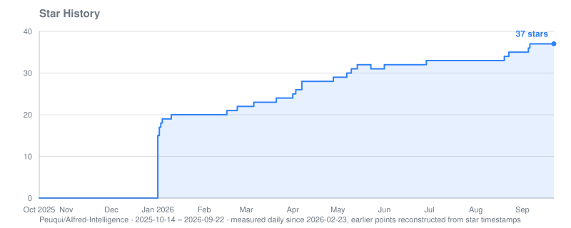

**🌍 Languages:** [English](README.md) | [Deutsch](README.de.md)

---


# AIfred Intelligence

**A self-hosted AI assistant that gets things done — tool chains, sub-agents, multi-agent debates, voice, camera surveillance and local LLM inference on your own hardware.**

AIfred runs on your own machine and works for you across every channel you use: it reads and answers e-mail, books appointments, manages contacts, documents and databases, watches your cameras and talks to you through the browser, Telegram, Discord or a voice terminal in your living room. Local models, persistent memory, no cloud dependency — your data stays with you.

**📺 [Example showcases](https://peuqui.github.io/AIfred-Intelligence/)** — exported chats: multi-agent debates, chemistry, maths, coding and web research.

> ⭐ **If AIfred is useful to you, please star the repo.** Self-hosters easily forget — but stars are the main signal that tells me people are actually using this. It directly affects whether I keep building.

**At a glance**
- 🔗 **Autonomous tool chains** across plugins — one prompt, many steps, from any channel
- 🎩 **Multi-agent system** — AIfred, Sokrates, Salomo and your own agents debate, criticise, judge — or take delegated tasks as sub-agents
- 📡 **Reachable everywhere** — web UI, Telegram, Discord, e-mail, Echo Dot voice terminal; runs headless
- 🎤 **Voice** — speech-to-text plus eight TTS engines, local voice cloning, streaming playback
- 👁️ **Vision & Vigilantia** — image analysis in chat and continuous camera surveillance with face recognition
- ⚙️ **Local inference, tuned automatically** — llama.cpp, vLLM and Ollama with VRAM-aware context calibration across multiple GPUs
- 🔒 **Security built into the framework** — permission tiers per channel, prompt-injection defences, credential broker, audit log

---

## 🔗 Complex Workflows (Tool Chains)

The real value doesn't come from individual tools but from **chains** that AIfred works through on its own across several plugins — from **any channel**: browser, voice terminal (FreeEcho.2), Telegram, Discord, e-mail.

**Example (real, tested end to end):** you photograph a business card with your phone and say — typed or spoken:

> *"Analyze this business card, extract all the data, create the contact in Google, check next week for a free morning, book a two-hour appointment, and send me the photo along with the contact details via Telegram."*

AIfred runs this as one continuous chain:

1. **👁️ Vision** — the VLM reads the card (name, phone, e-mail, address, web) directly from the image
2. **📇 Google Contacts** — creates the contact in structured form (`google_contacts_create`)
3. **📅 Google Calendar** — **first** checks the time window for free slots (`google_calendar_list_events`) and **only then** books the appointment; an existing appointment is recognised and AIfred asks back instead of creating a duplicate
4. **📤 Telegram with attachment** — sends you the **photo of the card** plus the contact details — without knowing your chat ID (owner default)

All local, a single prompt, no clicks in between. Files from the conversation (uploaded images, PDFs or plots from the sandbox) can be sent as attachments over **any** channel, isolated per session.

**Prerequisites & knobs:**
- **Security tier:** creating things (contact, appointment, running code) needs `WRITE_DATA` or higher. In the browser you always have it; external channels are raised as needed in the **Plugin Manager** — deliberately only there, no sender can grant itself rights. See [Security](#-security)
- **Vision + tool chains:** for reliable tool calls on the image path, **turn thinking off for the vision LLM** (🧠 icon; the 💭 reasoning prompt may stay on). Reasoning models with speculative decoding (MoE/MTP) otherwise swallow tool calls after thinking

---

## ✨ Features

### 🧠 Autonomous Agent & Tools

The LLM decides on its own which tools to use — OpenAI-compatible function calling, up to 100 tool calls per request, every tool delivered by a plugin:

- **E-mail** — read, search, send via IMAP/SMTP; sending needs explicit confirmation (draft → review → confirm)
- **Google Suite** — Calendar, Contacts, Drive and Tasks via OAuth 2.0
- **EssentialPIM** — full read/write access to the [EssentialPIM](https://www.essentialpim.com/) database: appointments, contacts, notes, to-dos, password entries; name-to-ID resolution and anti-hallucination guards
- **Workspace (files & documents)** — upload PDF, Word, Excel, PowerPoint, LibreOffice, TXT, MD, CSV; AIfred browses, reads (PDFs page by page), writes, patches, renames, copies, moves and deletes files, indexes them in ChromaDB (**bge-m3**, token-accurate chunking) and searches them semantically with folder filter and neighbour-chunk context. Document Manager UI with preview, bulk folder indexing and orphan cleanup
- **Sandboxed code execution** — Python in an isolated subprocess (numpy, pandas, matplotlib, plotly, scipy, sklearn, …); interactive HTML/JS results (Plotly 3D, canvas games, simulations) right in the chat, verified by a headless-browser screenshot
- **Web research** — the agent decides when to search: SearXNG (self-hosted) plus optional Tavily and Brave, LLM-based URL ranking, parallel scraping incl. PDFs; every research runs fresh, no result cache. Modes and pipeline: [Research Pipeline](docs/en/architecture/research-pipeline.md)
- **Long-term memory** — per-agent memory in ChromaDB, recalled before every answer; agents read, store, update and delete entries themselves. Memory Browser for inspection, incognito mode 🔒
- **Scheduler** — the LLM creates cron, interval and one-shot jobs; results arrive as notification, channel message or webhook. See [Scheduler](docs/en/architecture/scheduler.md)
- **More plugins** — **Audio Player** (library search, folders, seek, speed, resume), **System Monitor** (CPU, RAM, GPU, disk, temperatures), **Translator** (DeepL, 30+ languages), **Narrator** (whole documents → one MP3, multi-voice audio dramas via `[SPEAKER]:` markers), **Bible** and **Judaica** (exact passages + thematic vector search over Tanakh, Talmud, Mishnah, Midrash, Halacha, commentaries), **Calculator**
- **Tool-output cap** — a single tool result is trimmed so that system + history + memory + result stay within 75 % of the context; JSON-aware, the model still sees structured data

Every plugin is a directory under `aifred/plugins/tools/` or `aifred/plugins/channels/` — auto-discovered, switchable at runtime in the **Plugin Manager**. Overview: [Available Plugins](docs/en/guides/plugins-overview.md) · writing your own: [Plugin Development](docs/en/guides/plugin-development.md).

### 🎩 Multi-Agent System

- **Agents** — 🎩 AIfred (butler & scholar), 🏛️ Sokrates (critic), 👑 Salomo (judge), 📷 Vision, plus shipped custom agents 🔥 Pater Tuck, 🤖 Codine (code & sandbox), 🔴 HAL 9000, 🕎 Rabbi Shmuel — and as many of your own as you like: name, emoji, role, bilingual prompts, own memory, own model and voice, created in the **Agent Editor**
- **Five discussion modes**

  | Mode | Flow | Who decides? |
  |---|---|---|
  | **Standard** | One agent answers | — |
  | **Critical Review** | AIfred → Sokrates (critique + pro/contra) | You |
  | **Auto-Consensus** | AIfred → Sokrates → Salomo, N rounds | Salomo (votes) |
  | **Tribunal** | AIfred ↔ Sokrates, N rounds → Salomo | Salomo (verdict) |
  | **Symposion** | 2+ chosen agents discuss, reflection layer from round 2 | Nobody — many perspectives |

- **Sub-agents (delegation)** — any agent can hand a self-contained task to a sub-agent via `delegate_task`: a fresh model run with its own context and tool loop. Only the report returns to the caller; the full transcript sits collapsed in the chat bubble. A task can also go to another main agent with its persona, model and tools — measured with Qwen3.8-27B, AIfred's prompt shrinks from 31,730 to 17,449 tokens per turn (≈ 45 % less prefill). See [Sub-Agents](docs/en/guides/plugins/subagent.md)
- **Address agents by name** — "Sokrates, what do you think…?" — in every channel; mode switches by voice or text ("Start a tribunal and discuss X") in any language
- **Every agent sees the conversation from its own perspective**, prompts are assembled from up to ten layers (identity, reasoning, roles, task, memory, personality, tools, …)

Details — flows, prompt files, perspectives, labels: [Multi-Agent System](docs/en/architecture/multi-agent.md).

### 📡 Reachable Everywhere — Message Hub

AIfred watches external channels and answers on its own — **headless**, no browser needed. The web UI is only for setup and monitoring.

- **Channels** — **Telegram** and **Discord** bots, **e-mail** (IMAP IDLE push + SMTP replies), **FreeEcho.2** voice terminal; files as attachments on every channel
- **One pipeline** — listener → envelope normalisation → SQLite routing table → AIfred engine with the full toolkit → reply
- **User mapping** — Telegram IDs and e-mail addresses map to AIfred users (`data/user_mapping.json`), so AIfred recognises you everywhere
- **REST API** — remote control for browser sessions plus a webhook endpoint for headless runs: [REST API](docs/en/guides/rest-api.md)

Setup: [Telegram](docs/en/guides/telegram-setup.md) · [Discord](docs/en/guides/discord-setup.md) · architecture: [Message Hub](docs/en/architecture/message-hub.md).

### 🎤 Voice

- **Speech-to-text** — Whisper in Docker, a permanent CPU worker plus a GPU worker that unloads when idle; microphone dictation stays on the CPU, large uploads (meetings) go to the best free GPU, with duration estimate and confirmation for long files
- **Meeting pipeline** — transcribe in the original language → translate on demand (DeepL) → narrate into a phone-friendly MP3; every step leaves a file
- **FreeEcho.2 voice terminal** — Echo Dot 2 hardware with custom firmware: wake word, the question appears in the browser within ~500 ms after STT
- **Eight TTS engines**, per-agent voice, speed and pitch, gapless streaming playback, regenerate button per bubble:

| Engine | Type | Streaming | Quality | Latency* | Resources |
|--------|------|-----------|---------|----------|-----------|
| **Qwen3-TTS 1.7B** (default) | Local Docker | Sentence-level | High (voice cloning, 10 languages incl. native DE) | ~8.5 s | ~5–7 GB VRAM |
| **XTTS v2** | Local Docker | Sentence-level | High (voice cloning) | ~2.8 s | ~2 GB VRAM |
| **Fish-Speech S2 Pro** | Local Docker | Sentence-level | High (voice cloning, 80+ languages) | ~11 s | ~20–24 GB VRAM |
| **MOSS-TTS 1.7B** | Local Docker | None (batch after bubble) | Excellent (best open source) | ~14.8 s | ~11.5 GB VRAM |
| **DashScope Qwen3-TTS** | Cloud API | Sentence-level | High (voice cloning) | ~1–2 s/sentence | API key |
| **Piper** | Local | Sentence-level | Medium | < 100 ms | CPU |
| **eSpeak** | Local | Sentence-level | Low (robotic) | < 50 ms | CPU |
| **Edge TTS** | Cloud | Sentence-level | Good | ~200 ms | Internet |

\* Local cloning engines measured head to head on the same bilingual paragraph (V100, fp16) — full comparison and the story behind each engine: [TTS Model Comparison](docs/en/models/tts-comparison.md). Fish-Speech's non-commercial licence keeps it browser-only. TTS VRAM is measured under a worst-case burn-in and cached, not hand-tuned.

### 👁️ Vision & Vigilantia

**Image analysis in chat** — drop up to five images per message (crop dialog included), follow-up questions on the same image, a dedicated vision LLM (Qwen3-VL, DeepSeek-OCR, Ministral, any llama.cpp model with `--mmproj`) hands structured JSON to the main LLM.

**Vigilantia — camera surveillance.** The vision pipeline's watch mode turns AIfred into a continuous monitoring agent:

- **Sources** — webcams (V4L2/MJPEG) and RTSP/IP cameras; credentials only via the credential broker, never logged or shown to the LLM
- **Watchers per camera** — motion detection with zone masks (ignore / GDPR black-out / region of interest, painted over the live stream), face recognition (InsightFace) against the **Personarium** identity database, own YOLO confirmation for AI cameras' person/vehicle/animal events
- **Named, aggregated alerts** — one alert per happening, every recognised person named, unknowns and vehicles counted
- **Casus event browser** — filters, slideshow, VLM analysis per event or in bulk, near-duplicate clustering (pHash); nightly auto-describe so the chronicle is complete by morning
- **Vision tools for the LLM** — snapshot, analyse, enrol faces, start/stop watches, query events
- **Side-channel GPU** — the VLM gets its measured VRAM on a separate card, calibrated alongside the main LLM

Details: [Vision / Vigilantia plugin](docs/en/guides/plugins/vision.md).

### ⚙️ Local LLM Infrastructure

- **Backends** — **llama.cpp** via llama-swap (GGUF) and **vLLM** (as entries in the same llama-swap catalog), **Ollama**, **cloud APIs** (Claude, Qwen, DeepSeek, Kimi); switchable in the UI
- **Automatic context calibration** — VRAM-aware context sizing per model with a greedy cascade (fill the fastest GPU class first, spill to the next), binary search, RoPE scaling, tensor-split optimisation, speed variants with fewer GPUs; hardware-agnostic, no hand-tuned GPU lists. A 2D picker calibrates each combination of VLM and TTS engine as its own profile, with a capacity guard for the shared side-channel GPU. Algorithm: [Calibration Strategy](docs/de/architecture/calibration-strategy.md) (German) · vLLM: [vLLM Calibration](docs/en/architecture/calibration-vllm.md)
- **Zero-config models** — `ollama pull …` or `hf download …`, then `llama-swap-restart`: the autoscan finds the model, tests it, writes the YAML entry, groups and VRAM cache. See [llama.cpp setup](docs/en/guides/llamacpp-setup.md)
- **Per-agent tuning** — model, sampling, reasoning prompt 💭 and thinking 🧠 separately, reasoning effort, context size and speed variant per agent
- **History compression** — at 70 % context utilisation the oldest messages become summaries: conversations of unlimited length
- **Distributed inference** — llama.cpp RPC across machines in the LAN

Settings, compression, performance tuning: [Configuration](docs/en/guides/configuration.md).

### 🔒 Security

Enforced by the framework, not left to plugins:

- **Five permission tiers** — READONLY → COMMUNICATE → WRITE_DATA → WRITE_SYSTEM → ADMIN; every tool has a fixed tier (badges T0–T4 in the Agent Editor), every channel a configurable maximum
- **Prompt-injection defences** — inbound sanitisation (HTML strip, zero-width removal, NFC), `<external_message>` fencing with sender and trust level, security-boundary prompt, research results fenced as untrusted data
- **Rule of two** — write-tier tools are blocked for external channels unless raised in the Plugin Manager
- **Limits** — rate limiting per channel, max 100 tool calls per request
- **Secrets** — plugins only get credentials via the credential broker; secret patterns are stripped from tool output
- **Audit log** — every tool call with time, channel, tool, tier and result
- **Login everywhere** — accounts with whitelist, signed cookies on every API route, tokens for the remote-control endpoints

Details: [Security Architecture](docs/en/architecture/security.md).

### 🖥️ UI & Sessions

- **Settings modal** (☰) — Agent Editor, Memory Browser, database management, Plugin Manager, audit log
- **Accounts** — username + password, whitelist-based registration; sessions belong to you and follow you across devices
- **Sessions** — chat list with LLM-generated titles; agent, discussion mode and research mode are stored per session
- **Share chat** — export as a self-contained HTML file (KaTeX inline, TTS audio embedded, works offline)
- **LaTeX & chemistry** (KaTeX, mhchem), HTML preview, Harmony format for GPT-OSS

---

## 🚀 Quick Start

**Requirements:** Linux with systemd, Python 3.10+, Docker, an NVIDIA GPU (CUDA) with enough VRAM for the models you want, and one LLM backend — llama.cpp via llama-swap (recommended, [setup](docs/en/guides/llamacpp-setup.md)) or Ollama (easiest start).

```bash
git clone https://github.com/Peuqui/AIfred-Intelligence.git
cd AIfred-Intelligence
./scripts/install-all.sh
```

The interactive installer handles system packages (apt, dnf, pacman, brew), the Python venv and requirements, the Playwright browser, the Reflex patch, `.env`, ChromaDB + SearXNG, the bge-m3 embedding model, optional systemd services and a first whitelist user. Ollama itself is **not** installed automatically (its official installer is `curl | sh` — do that yourself).

Then:
1. **Register** in the web UI with the whitelisted username (`./aifred-admin add <name>` for more users)
2. **Reach the UI through a reverse proxy** — the app runs as two processes (frontend `3002`, backend `8002`); without a proxy images and audio stay blank. nginx example: [Access the web UI](docs/en/guides/deployment.md#access-the-web-ui)
3. **Add models** and **calibrate** them in the UI

Step by step, services, `.env`, Polkit, vision and camera setup: [Deployment Guide](docs/en/guides/deployment.md).

**Is AIfred for me?** It is a personal assistant — built for one user, fine for a household of two or three. Backend, models and settings are shared by everyone; it is not a multi-tenant service. More: [Configuration → Multiple users](docs/en/guides/configuration.md#multiple-users).

---

## 📚 Documentation

Full index: [docs/README.md](docs/README.md)

| Topic | Documents |
|---|---|
| Setup | [Deployment](docs/en/guides/deployment.md) · [llama.cpp + llama-swap](docs/en/guides/llamacpp-setup.md) · [Configuration](docs/en/guides/configuration.md) · [Telegram](docs/en/guides/telegram-setup.md) · [Discord](docs/en/guides/discord-setup.md) |
| Using & extending | [Plugins](docs/en/guides/plugins-overview.md) · [Plugin Development](docs/en/guides/plugin-development.md) · [REST API](docs/en/guides/rest-api.md) |
| Architecture | [Multi-Agent](docs/en/architecture/multi-agent.md) · [Research Pipeline](docs/en/architecture/research-pipeline.md) · [LLM Call](docs/en/architecture/llm-call.md) · [Message Hub](docs/en/architecture/message-hub.md) · [Security](docs/en/architecture/security.md) · [Scheduler](docs/en/architecture/scheduler.md) · [Codebase](docs/en/architecture/codebase.md) |
| Calibration | [Strategy](docs/de/architecture/calibration-strategy.md) (German) · [vLLM](docs/en/architecture/calibration-vllm.md) |
| Benchmarks | [vLLM Auto-Calibration](docs/en/benchmarks/vllm-autocalibration.md) · [Quantization Quality](docs/en/benchmarks/quantization-quality.md) · [Tensor Split](docs/en/benchmarks/tensor-split.md) |

---

## Star History



<sub>Collected by the repo itself: a daily workflow records the star count and renders the chart. GitHub restricted the stargazer API to repo admins on 2026-06-30, so external chart services now need a token with write access.</sub>

## 📄 License

PolyForm Noncommercial License 1.0.0 — see [LICENSE](LICENSE).

Free for personal, educational and non-commercial use. Commercial use requires a separate licence from the author.

---

## ☕ Support

If you find this project useful, consider supporting me:

[](https://ko-fi.com/peuqui)
